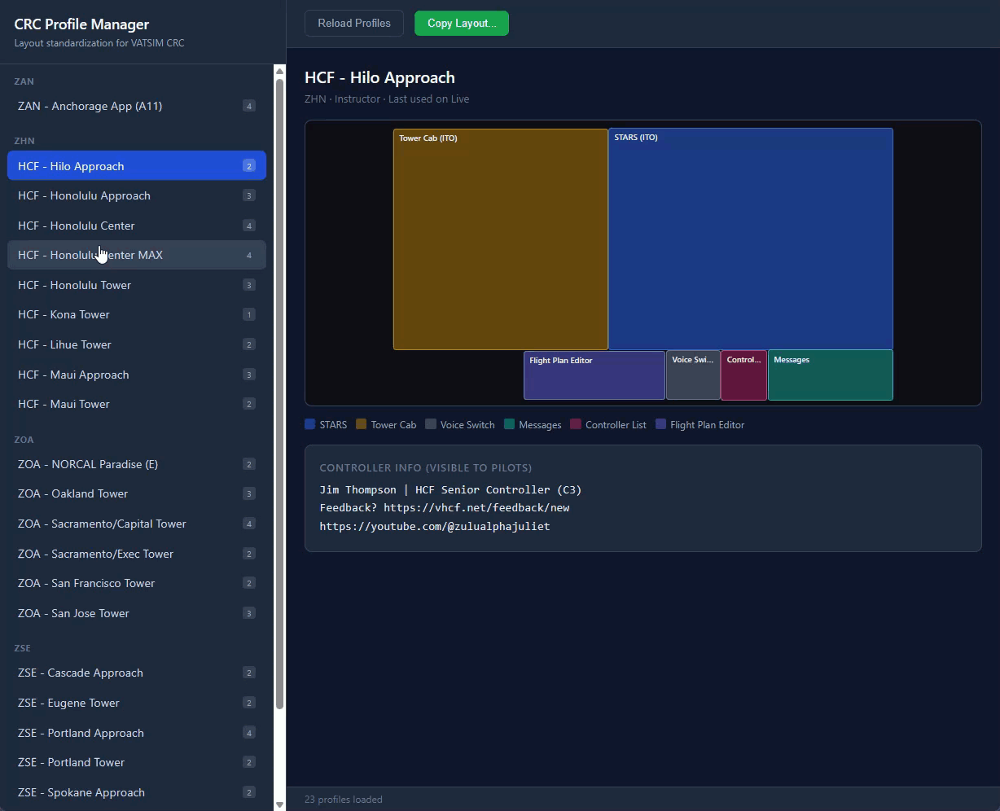
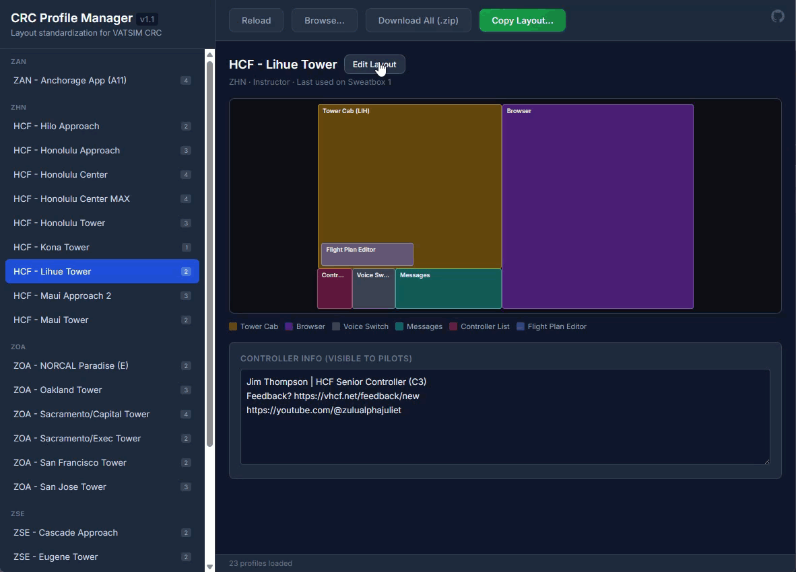

# VATSIM CRC Profile Manager

A browser-based tool for VATSIM controllers to manage their [CRC (Common RADAR Client)](https://crc.virtualnas.net) profiles — visualize window layouts, edit them visually, standardize across positions, and keep controller info text consistent.

## What it does

CRC stores one JSON file per controller profile in `%LOCALAPPDATA%\CRC\Profiles`. If you control multiple positions or facilities, keeping those profiles consistent is tedious. This tool makes it easy.

* **Visualize** — color-coded layout preview showing every window's position and size for any profile
* **Edit Layout** — full-screen visual editor to drag, move, and resize windows with grid snap and boundary controls
* **Copy Layout** — copy window positions from one profile to others in a few clicks
* **Edit Controller Info** — modify the controller info text (visible to pilots on VATSIM) directly in the app
* **Sync Controller Info** — copy your `ControllerInfo` text across profiles, with automatic feedback URL substitution per ARTCC
* **Safe by design** — only portable fields are modified; radar center, range, facility IDs, and other position-specific settings are never touched

## Screenshots

**Browse and preview profiles**



**Visual layout editor with grid snap**



## Usage

### Loading profiles

1. Open the app (served over HTTP — see below)
2. Drag your `%LOCALAPPDATA%\CRC\Profiles` folder (or individual JSON files) into the browser window
3. Alternatively, click **Browse for JSON files** to select profiles manually

### Viewing and editing

4. Select a profile from the sidebar to preview its layout
5. Edit the **Controller Info** text directly in the text area below the preview
6. Click **Edit Layout** to open the full-screen visual editor:
   - **Click and drag** a window to move it
   - **Ctrl+click and drag** to resize from the nearest edge or corner
   - Toggle **Grid** to show alignment lines (50, 100, or 200px spacing)
   - Toggle **Snap** to lock movement to the grid
   - Open **Boundaries** to set custom layout bounds (e.g., monitor resolution) and optionally enforce them
   - Click **Save & Close** to save changes and download the updated profile

### Downloading changes

* **Save & Close** in the editor downloads the updated profile JSON
* **Download All (.zip)** in the toolbar exports every loaded profile as a zip
* Click the download arrow next to any profile in the sidebar to download just that one
* Copy downloaded files back into your `%LOCALAPPDATA%\CRC\Profiles` folder

### Copying layouts across profiles

7. Click **Copy Layout...** to copy a layout to one or more other profiles
8. Download the zip and extract into your Profiles folder

Use **Reload** in the toolbar to re-read your profiles after CRC has written changes.

## Running locally

The app must be served over HTTP — opening `index.html` directly as a `file://` URL will not work (Chrome blocks cross-origin script loads). The easiest option is the [Live Server](https://marketplace.visualstudio.com/items?itemName=ritwickdey.LiveServer) extension in VS Code, or:

```
npx serve .
```

Then open [`http://127.0.0.1:5500`](http://127.0.0.1:5500) (Live Server) or `http://localhost:3000` (serve).

## Copy Layout — what gets copied

| Copied (portable)                             | Not copied (facility-specific)         |
| --------------------------------------------- | -------------------------------------- |
| Window positions and sizes (`Bounds`)         | Radar center lat/lon                   |
| `IsVisible`, `IsMaximized`, `ShowTitleBar`    | Range                                  |
| `ScaleFactor`, `CoverTaskBarWhenMaximized`    | `FacilityId`, `AreaId`, `PositionId`   |
| `ControllerInfo` text (with URL substitution) | Video map selections, weather settings |

## Feedback URL substitution

When copying Controller Info across ARTCCs, the app automatically swaps the feedback URL based on the target profile's `ArtccId`. Default URLs are included for all US facilities; confirmed URLs for ZHN/ZUA, ZSE, ZOA, and ZAN.

## Tech

No build step. React 18 + JSZip loaded from CDN, JSX transpiled in-browser by Babel. No backend — everything runs client-side.

```
index.html   ← app shell
css/app.css  ← styles
js/app.js    ← React app
docs/        ← design docs
```

## Planned

* Named layout templates — save and re-apply a layout without needing a source profile
* Template sharing — export/import for ARTCC training staff
* Layer 3: copy display preferences (brightness, char sizes, leader settings) while excluding facility-specific fields
* User-overridable feedback URLs per ARTCC
